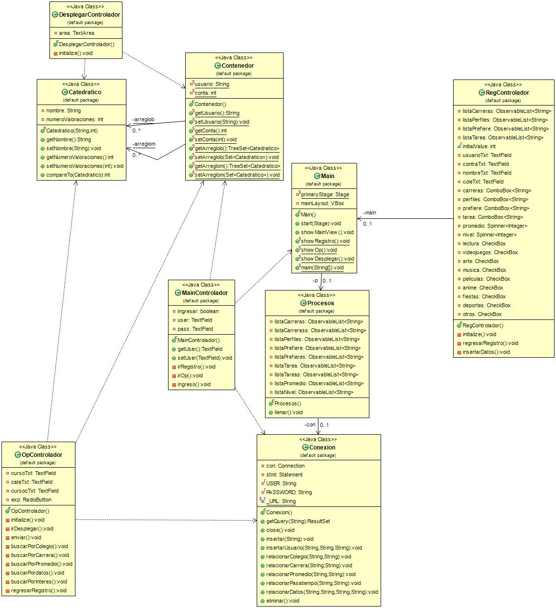

# Proyecto-2
Proyecto correspondiente al curso de Algoritmos y estructuras de datos. Sistema de recomendaciones.
Algoritmos y estructuras de datos
Sección: 30
Por favor cualquier curiosidad no copiar, consultar al autor.
# Autores:
Carlos Calderón carné: 15219, Jorge Azmitia carné: 15202 , Marisol Barillas carné: 15307

# Descripción
Ambas fases del proyecto se encuentran aquí. Para la parte 2 el archivo llamado proyecto2 incluye documentación con usuarios y del programa. Asimismo, se encuentra la base de datos modelada en un archivo.

# UML

